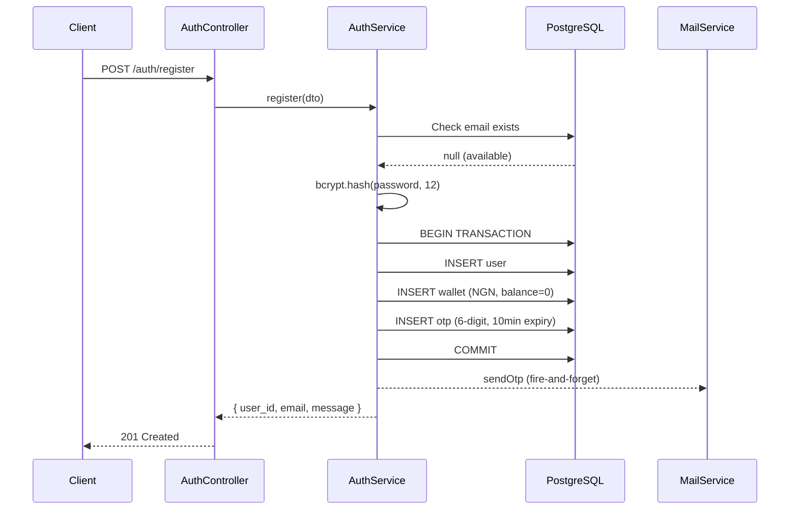
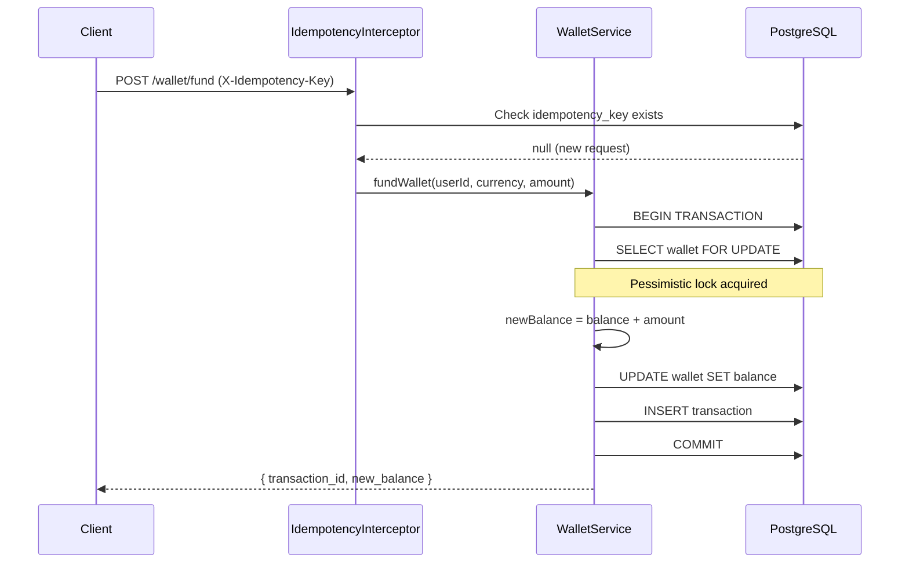
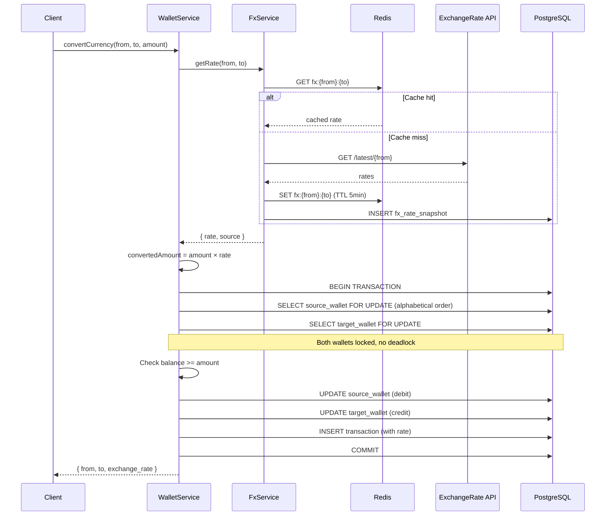
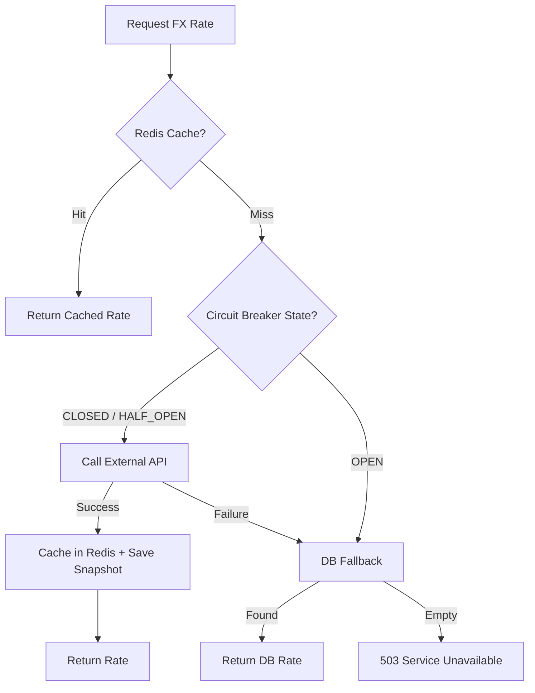
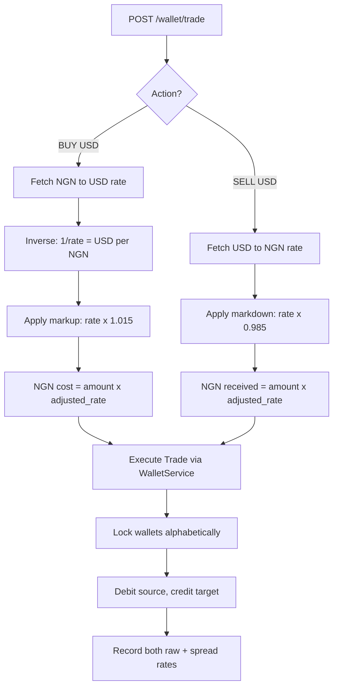

# FX Trading App Backend

Backend service for an FX trading platform. Handles user registration with email verification, multi-currency wallets, real-time currency conversion, NGN trading with spread, and transaction history.

Built with NestJS, TypeORM, PostgreSQL, and Redis.

## Setup

```bash
git clone https://github.com/Olayanju-1234/credpal-assessment.git
cd credpal-assessment
npm install
docker compose up -d          # starts PostgreSQL and Redis
cp .env.example .env          # add FX_API_KEY, MAIL_USER, MAIL_PASSWORD
npm run migration:run         # creates database tables
npm run start:dev             # http://localhost:3000
```

Swagger docs at `http://localhost:3000/api/docs`

**Requirements:** Node.js >= 18, Docker

**Environment variables:**
- `FX_API_KEY` from [exchangerate-api.com](https://www.exchangerate-api.com) (free tier)
- `MAIL_USER` and `MAIL_PASSWORD` for SMTP (Gmail app password works)

## Tech Stack

| Layer | Technology | Rationale |
|-------|-----------|-----------|
| Framework | NestJS 10 | Modular, TypeScript-first |
| ORM | TypeORM 0.3 | Migrations, query builder, `SELECT FOR UPDATE` support |
| Database | PostgreSQL 16 | DECIMAL precision, row-level locking, JSONB |
| Cache | Redis 7 | FX rate caching (5-min TTL) |
| Auth | JWT via Passport | Stateless, 15-min access tokens |
| Money | decimal.js | All amounts as `DECIMAL(18,4)`, never floats |
| Docs | Swagger/OpenAPI | Auto-generated from decorators |
| Email | Nodemailer | SMTP transport |

## Project Structure

```
src/
├── common/
│   ├── decorators/     @CurrentUser, @VerifiedOnly, @Roles, @IdempotencyKey
│   ├── guards/         JwtAuthGuard, VerifiedGuard, RolesGuard
│   ├── interceptors/   IdempotencyInterceptor, ActivityLogInterceptor, ResponseTransformInterceptor
│   ├── filters/        GlobalExceptionFilter (maps 7 PostgreSQL error codes)
│   ├── enums/          Currency, TransactionType, TransactionStatus, Role
│   └── utils/          decimal.util.ts, lock-order.util.ts
├── config/             database, redis, jwt, fx, mail (typed with @nestjs/config)
├── modules/
│   ├── auth/           Register, verify OTP, resend OTP, login
│   ├── user/           User entity, service, admin controller
│   ├── otp/            6-digit OTP generation and validation
│   ├── wallet/         Multi-currency wallets, funding, conversion
│   ├── trading/        NGN trades with spread
│   ├── fx/             Rate fetching, Redis cache, circuit breaker, DB fallback
│   ├── transaction/    Transaction history (paginated, filterable)
│   ├── activity-log/   Audit trail for all API requests
│   └── mail/           OTP email delivery
└── database/
    ├── migrations/
    └── data-source.ts
```

## API Endpoints

### Auth
| Method | Path | Auth | Description |
|--------|------|------|-------------|
| POST | `/auth/register` | No | Register and send OTP email |
| POST | `/auth/verify` | No | Verify email with 6-digit OTP |
| POST | `/auth/resend-otp` | No | Resend verification OTP |
| POST | `/auth/login` | No | Get JWT access token |

### Wallet
| Method | Path | Auth | Idempotent | Description |
|--------|------|------|-----------|-------------|
| GET | `/wallet` | Verified | | List all currency balances |
| POST | `/wallet/fund` | Verified | Yes | Fund wallet in any supported currency |
| POST | `/wallet/convert` | Verified | Yes | Convert between any two currencies |
| POST | `/wallet/trade` | Verified | Yes | Trade NGN against foreign currency (with spread) |

### FX Rates
| Method | Path | Auth | Description |
|--------|------|------|-------------|
| GET | `/fx/rates?base=NGN&currencies=USD,EUR,GBP` | No | Current exchange rates |

### Transactions
| Method | Path | Auth | Description |
|--------|------|------|-------------|
| GET | `/transactions` | Verified | User's transaction history (paginated, filtered) |

### Admin
| Method | Path | Auth | Description |
|--------|------|------|-------------|
| GET | `/admin/users` | Admin | List all users |
| GET | `/admin/transactions` | Admin | View all transactions across users |

All mutation endpoints require an `X-Idempotency-Key` header (UUID).

## Architectural Decisions

### Multi-Currency Wallet Model
One wallet row per `(user_id, currency)` pair with a `UNIQUE` constraint. This gives independent row-level locking per currency, so two operations on different currencies for the same user don't block each other.

### Concurrency Safety
All balance mutations use `SELECT ... FOR UPDATE` inside database transactions. When a conversion or trade touches two wallets, locks are acquired in alphabetical order by currency code (EUR before GBP before NGN before USD). This prevents deadlocks when concurrent requests convert in opposite directions.

```
Concurrent NGN→USD and USD→NGN:
Both acquire: lock(NGN) then lock(USD). No deadlock.
Without ordering: A locks NGN, B locks USD → deadlock.
```

### Idempotency (Two Layers)
1. `IdempotencyInterceptor` checks if the key already exists before processing. Duplicates return the cached result, not an error.
2. `UNIQUE` constraint on `transactions.idempotency_key` catches concurrent duplicates that slip past the interceptor.

### FX Rate Resilience
```
Redis Cache (5-min TTL) → External API (5s timeout) → DB Fallback (latest snapshot)
```
A circuit breaker protects the external API: opens after 3 consecutive failures, probes again after 30 seconds. All fetched rates are persisted as snapshots for fallback and audit.

### Financial Arithmetic
All monetary calculations use `decimal.js` with `ROUND_DOWN`. Amounts are stored as `DECIMAL(18,4)` in PostgreSQL and passed as strings in TypeScript. No floating-point math anywhere.

### Trade Spread
`/wallet/convert` uses the raw market rate. `/wallet/trade` applies a configurable spread (default 1.5%):
- BUY foreign currency: rate marked up (× 1.015)
- SELL foreign currency: rate marked down (× 0.985)

Both the raw rate and the applied rate are recorded in the transaction.

## Database Schema

### Tables
- **users** - Authentication, roles (USER/ADMIN), email verification status
- **otps** - 6-digit codes, 10-minute expiry, single-use
- **wallets** - One per (user, currency), `DECIMAL(18,4)` balance
- **transactions** - Full ledger (FUNDING, CONVERSION, TRADE) with rates and idempotency keys
- **fx_rate_snapshots** - Every rate fetched, for fallback and audit
- **activity_logs** - Request audit trail (user, method, path, IP, status, response time)

### Indexes
- `UNIQUE(user_id, currency)` on wallets
- `UNIQUE(idempotency_key)` on transactions
- `(user_id, created_at DESC)` on transactions
- `(base_currency, target_currency, created_at DESC)` on fx_rate_snapshots
- `(user_id, created_at)` on activity_logs

## Assumptions

1. **FX rates** come from [ExchangeRate-API](https://www.exchangerate-api.com) (free tier). The system degrades gracefully to cached or DB rates when the API is unavailable.
2. **Wallet funding** is simulated. `POST /wallet/fund` directly credits the wallet without a payment gateway.
3. **Spread** is configurable via `FX_SPREAD_PERCENT` env var (default 1.5%).
4. **Supported currencies**: NGN, USD, EUR, GBP, CAD, CHF, JPY, AUD, CNY. Currency columns use `varchar(3)` instead of database enums, so adding a new currency only requires a one-line TypeScript change.
5. **Email delivery** is fire-and-forget. If SMTP is down, registration still succeeds.

## Tests

```bash
npm run test          # unit tests
npm run test:watch    # watch mode
npm run test:cov      # coverage report
```

39 unit tests across 4 services:
- **AuthService** (12): Registration, OTP verification, login, error paths
- **WalletService** (11): Funding, conversion math, insufficient balance, decimal precision
- **TradingService** (7): Spread calculation (BUY/SELL), NGN enforcement, validation
- **FxService** (9): Cache hit/miss, circuit breaker states, DB fallback

## Security

- Passwords hashed with bcrypt (12 salt rounds)
- 15-minute JWT access tokens
- Rate limiting: 3-5 req/min on auth, 30/min globally
- Input validation with `class-validator` (whitelist + forbidNonWhitelisted)
- Login responses never reveal whether email or password was wrong
- Admin endpoints guarded by `@Roles(Role.ADMIN)`
- OTPs are single-use, expire in 10 minutes, invalidated on resend
- All mutations require `X-Idempotency-Key`
- Activity logging on every request (user, IP, user agent, response time)

## Scaling Path

- **Database**: Read replicas for history queries. Partition transactions by month. PgBouncer for connection pooling.
- **Wallet locking**: Row-level locks are held briefly and work well under contention. At extreme scale, advisory locks or event sourcing could replace them.
- **FX rates**: Redis already serves a single cached rate to all users. At scale, a dedicated worker refreshing on a schedule would replace on-demand fetching.
- **Idempotency**: Move checks to Redis (with TTL) to reduce DB reads on every mutation.
- **Horizontal scaling**: The app is stateless (JWT, no sessions). Multiple instances behind a load balancer, Redis already external.
- **Rate limiting**: Move from in-memory throttler to Redis-backed for consistency across instances.
- **Email**: Replace fire-and-forget with a message queue (BullMQ).

## Scripts

```bash
npm run start:dev          # dev mode with hot reload
npm run start:prod         # production mode
npm run build              # compile TypeScript
npm run test               # run unit tests
npm run migration:generate # generate a new migration
npm run migration:run      # run pending migrations
npm run migration:revert   # revert last migration
```

## Flow Diagrams

### Registration


### Wallet Funding


### Currency Conversion


### FX Rate Resolution


### Trading (with Spread)

